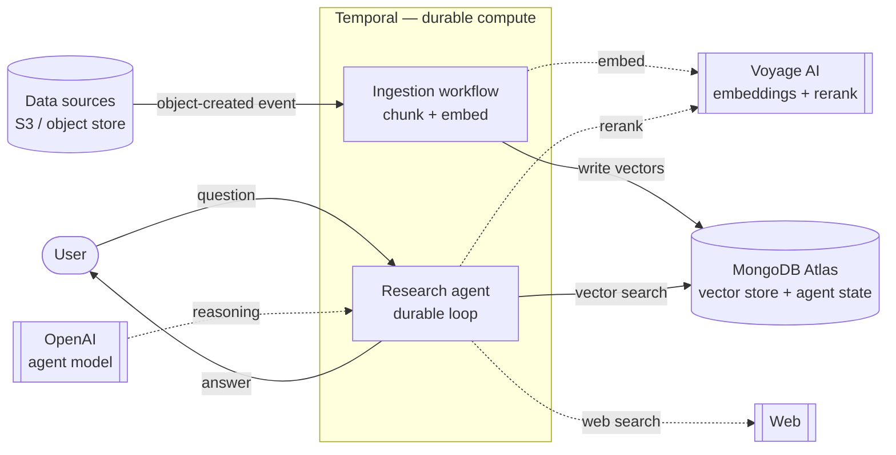
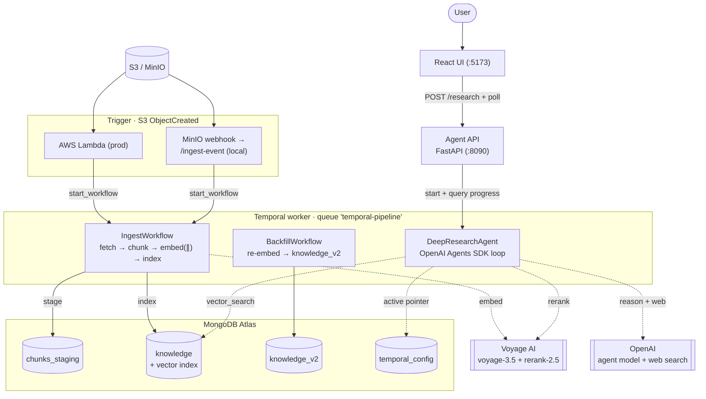
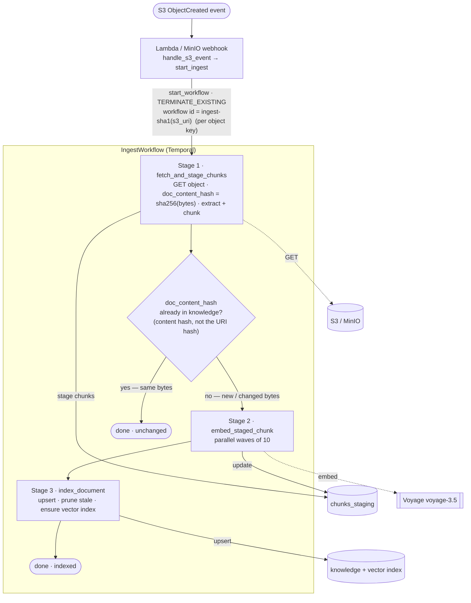
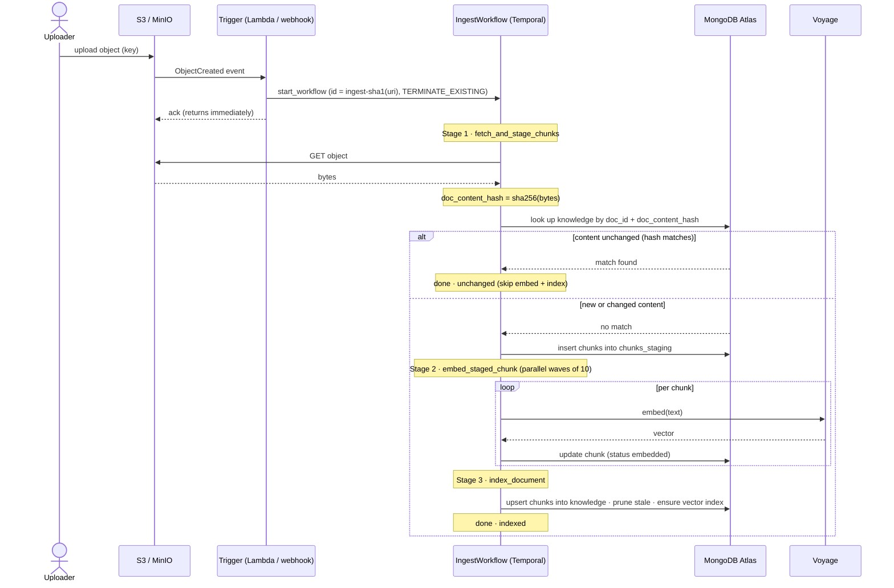
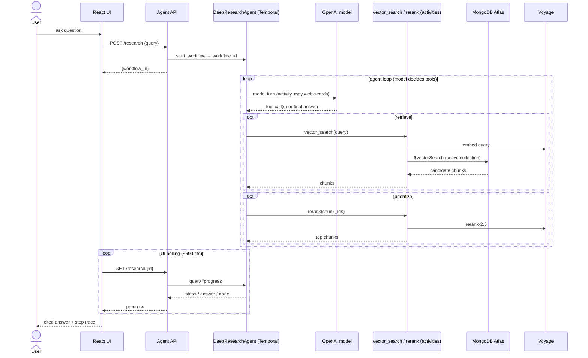

# MongoDB × Temporal — Partner Reference Architecture

A production-grade reference implementation that shows how **Temporal** and **MongoDB Atlas** work
together to build a durable, change-driven RAG pipeline with a deep-agent chat interface.

> **Developers:** see [docs/RUNBOOK.md](docs/RUNBOOK.md) for prerequisites, API key setup,
> local spin-up, and cloud infra references.

---

## What is Temporal?

[Temporal](https://temporal.io) is a **durable execution platform**. It orchestrates long-running
workflows as code — with automatic retries, checkpointing, and resume-on-failure built in. You
write plain Python functions; Temporal ensures they run to completion even across crashes, deploys,
or network partitions.

In this architecture Temporal owns two critical concerns:

| Concern            | What Temporal guarantees                                                                                                                                                                          |
| ------------------ | ------------------------------------------------------------------------------------------------------------------------------------------------------------------------------------------------- |
| Ingestion pipeline | A crash mid-embedding resumes from the last completed chunk — never re-embeds what is already done ([durable execution](https://docs.temporal.io/evaluate/major-advantages#fault-oblivious-code)) |
| Agent workflows    | Multi-step agent plans are durable; a failure mid-conversation resumes without losing tool results or memory writes ([workflows as code](https://docs.temporal.io/workflows))                     |

---

## The problem this solves

Customers hand-roll resilient ingestion/embedding pipelines and it hurts
(source: [MongoDB × Temporal proposal](https://docs.google.com/document/d/1pReiGwWCwFj28nWsZ6NiCA9nWrqhcaWgF51s_odUeCs/edit?tab=t.0#heading=h.54b4x1c9rtcf)):

| Customer     | Pain hand-rolled without Temporal                                        |
| ------------ | ------------------------------------------------------------------------ |
| Regilient AI | MD5 change-tracking in production to decide what to re-embed             |
| Glassdoor    | A homegrown "lambda clock" cron to generate embeddings                   |
| Carrier      | A FastAPI pipeline, hand-tuning sequential vs. parallel                  |
| Emerald X    | A 5-hour import that fails on the last step **reruns the entire import** |

This PRA packages the pattern that removes that pain — already in production at DEA Technology,
100ms, Chess.com, and C.R. England.

---

## Partner Solutions Architecture

### High-level design



**How to read it:**

1. **A new object lands in object storage** (AWS S3, or MinIO locally).
2. **The object-created event starts the Temporal `IngestWorkflow` directly** — via an AWS
   Lambda for real S3, or a MinIO webhook locally. Both call the same handler
   (`pipeline/lambda_handler.py` / `POST /ingest-event`).
3. **Temporal** chunks the content, calls **Voyage AI** for embeddings, and upserts into
   **Atlas Search**.
4. A **durable research agent** (OpenAI Agents SDK, running as a Temporal workflow) answers
   questions over the fresh knowledge, using vector search + rerank (and web search) as tools.

> **Design note:** the direct trigger (Lambda / MinIO webhook → `IngestWorkflow`) leverages 
> Temporal's durable execution to provide the "don't lose the
> event once the workflow starts" guarantee. 

### Division of responsibility

| Concern                                                       | Owner                 |
| ------------------------------------------------------------- | --------------------- |
| Orchestration, retries, checkpointing, backfill, resumability | **Temporal**          |
| Operational data, vector index, agent memory & state          | **MongoDB Atlas**     |
| Embeddings & reranking                                        | **MongoDB Voyage AI** |
| Agent reasoning & answers                                     | **OpenAI (Agents SDK)** |

---

## System architecture



### Atlas data model

```text
Database: temporal
├── chunks_staging       ← intermediate chunks during IngestWorkflow
├── knowledge            ← embedded docs + Atlas Vector Search index (active)
├── knowledge_v2         ← BackfillWorkflow writes here on model upgrade (blue/green)
├── temporal_config      ← active collection/index pointer (flipped by cutover)
└── agent_memory         ← reserved for agent memory (not yet written)
```

Retrieval and (future) agent memory live in the **same database** — no second copy, and no sync
lag between what the pipeline writes and what the agent reads.

---

## Ingestion

Ingestion turns objects landing in storage into embedded, searchable knowledge — durably, and
**without a message broker**. An S3 **ObjectCreated** event starts a Temporal `IngestWorkflow`
directly (an AWS Lambda in production, a MinIO webhook locally — both through the shared
`handle_s3_event`). The moment `start_workflow` returns, the change is safe: Temporal runs the
workflow to completion across retries, worker restarts, and infra maintenance.

- **Trigger goes directly to Temporal** Temporal's durable execution provides the "don't lose the 
  event" guarantee; the trigger is a thin adapter (`pipeline/lambda_handler.py` /
  `POST /ingest-event`).
- **Idempotent, update-in-place.** A content-hash check skips re-embedding unchanged objects; an
  edited object re-embeds and upserts in place (see the two-hashes note below).
- **Parallel & scale-out.** Chunks embed in parallel waves; add worker processes on the same task
  queue to scale horizontally.
- **Output.** Embedded chunks land in `knowledge` with an Atlas Vector Search index, ready for the
  agent. Internals: `docs/LLD.md` §5–6.

### Ingest workflow



> **Two hashes, two jobs.** The **workflow id** hashes the *URI* — `sha1(s3_uri)` — so it's
> stable per object key: a re-upload reuses the id, and `TERMINATE_EXISTING` replaces any
> in-flight run. The **dedupe check** hashes the *content* — `doc_content_hash = sha256(bytes)`
> — so an *edited* file (new bytes) misses the check and is re-embedded, while an *unchanged*
> re-upload matches and short-circuits.

### Sequence — ingestion



---

## The agent

The agent answers questions over the ingested knowledge as a **durable Temporal workflow**
(`DeepResearchAgent`), built with the **OpenAI Agents SDK**. Instead of a fixed
retrieve → rerank → answer chain, the model is handed the retrieval pipeline as **tools** and
decides which to call, and how often.

- **Tools.** `vector_search` and `rerank` are Temporal activities over Atlas + Voyage, plus a
  hosted **web search** to supplement the corpus.
- **Durable & auditable.** The reasoning loop *is* a workflow, so every model and tool call is a
  history event — resumable after a crash and fully inspectable in the Temporal UI.
- **Live progress.** Run hooks record human-readable steps; the UI starts the run
  (`POST /research`) and polls a workflow `query` (`GET /research/{id}`) to show the trace as it
  unfolds (step-level, not token streaming).
- **Opt-in.** Loads only when `OPENAI_API_KEY` is set — ingestion runs without it. Full design:
  `docs/agent-retrieval.md`.

### Sequence — research query



---

## Quickstart (local demo)

```bash
# 1. Clone and enter the repo
git clone https://github.com/suresharam/mongodb-temporal-sa-pra.git
cd mongodb-temporal-sa-pra

# 2. Copy and fill in credentials
cp .env.example .env
# Edit .env: set MONGODB_URI, VOYAGE_API_KEY, OPENAI_API_KEY

# 3. Install all dependencies (Python + UI)
make setup

# 4. Start everything (MinIO, Temporal, worker, trigger API, agent API + UI)
make start

# 5. Create the Atlas Vector Search index (one-time)
make index

# 6. Seed a sample document to trigger the full pipeline
make seed

# 7. Open the agent UI
open http://localhost:5173

# 8. Tear everything down
make stop
```

`make help` lists all available targets.

| Service           | URL                   | Login                                          |
| ----------------- | --------------------- | ---------------------------------------------- |
| Agent chat UI     | http://localhost:5173 |                                                |
| Temporal Web UI   | http://localhost:8233 |                                                |
| Agent API         | http://localhost:8090 |                                                |
| MinIO console     | http://localhost:9001 | username: `minioadmin`, password: `minioadmin` |
| Trigger API       | http://localhost:8088 | webhook `/ingest-event` (default local trigger) |

---

## Repo layout

```text
mongodb-temporal-sa-pra/
├── README.md
├── Makefile                        ← all dev commands (make help)
├── pyproject.toml                  ← Python deps managed by uv
├── .env.example                    ← copy → .env, fill credentials
├── tests/                          ← pytest (uv run pytest) — handler + parser tests
├── agent/
│   ├── api.py                      ← FastAPI: /research start + poll (:8090)
│   ├── agent_workflow.py           ← DeepResearchAgent (OpenAI Agents SDK loop as workflow)
│   ├── tools.py                    ← agent tools: vector_search, rerank (as activities)
│   └── ui/                         ← React/Vite chat UI (:5173)
├── pipeline/
│   ├── worker.py                   ← Temporal worker process
│   ├── trigger.py                  ← shared handle_s3_event → start IngestWorkflow
│   ├── trigger_api.py              ← webhook /ingest-event + manual /ingest-trigger
│   ├── lambda_handler.py           ← AWS Lambda entrypoint for real S3 (same handler)
│   ├── workflows/
│   │   ├── ingest_workflow.py      ← IngestWorkflow: fetch → chunk → embed → index
│   │   └── backfill_workflow.py    ← BackfillWorkflow: re-embed → knowledge_v2
│   ├── activities/
│   │   ├── ingest.py               ← fetch + stage + embed + index activities
│   │   └── backfill.py             ← re-embed activity
│   ├── extractors/                 ← md / pdf / csv / text extractors
│   ├── config_store.py             ← active collection/index pointer
│   └── search_index.py             ← idempotent Atlas Vector Search management
└── infra/
    ├── docker-compose.yml          ← MinIO (S3 events → webhook /ingest-event)
    └── atlas_indexes.json          ← Vector Search index definitions
```

---

## Developer guide

| Document                               | Description                                                                                       |
| -------------------------------------- | ------------------------------------------------------------------------------------------------- |
| **[docs/RUNBOOK.md](docs/RUNBOOK.md)** | Prerequisites, API key setup, local spin-up, cloud infra references                               |
| **[docs/LLD.md](docs/LLD.md)**         | Low-level design — data contracts, workflow internals, scaling to multiple sources and data types |
| **[docs/agent-retrieval.md](docs/agent-retrieval.md)** | The deep agent — retrieval, rerank, synthesis, and how it ties to the vector store |
| **[docs/decisions/](docs/decisions/)** | Architecture Decision Records — e.g. ADR 0001 (direct-from-S3 triggering)                          |
